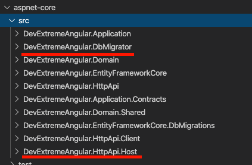
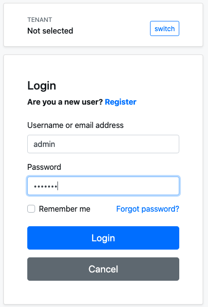
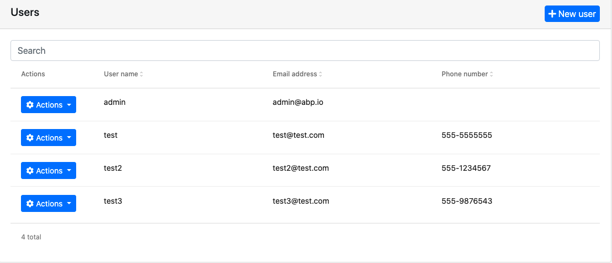

## Using DevExtreme Angular Components With the ABP Framework

Hello, this is a follow up on the article [Using DevExtreme Components With the ABP Framework](https://community.abp.io/articles/using-devextreme-components-with-the-abp-framework-zb8z7yqv)

We will create the same application using Angular as the UI framework and integrate [DevExpress Angular components](https://js.devexpress.com/Documentation/Guide/Angular_Components/DevExtreme_Angular_Components/). 

## Create the Project

Let's create an application using [ABP CLI](https://docs.abp.io/en/abp/latest/CLI#new)

```bash
abp new DevExtremeAngular -u angular
```

After the project is created, you should run following projects in order



Firstly, run `DevExtremeAngular.DbMigrator` for db migration and then run `DevExtremeAngular.HttpApi.Host` for backend APIs.

After the backend is ready, navigate to `angular` folder and run `yarn` or `npm install` based on which package you are using. 

After installation process is done, you can start your angular project by running `yarn start` or `npm start`

Everything should run smoothly and when you go to http://localhost:4200 in the browser, you should see your application up and running.


You can login to the application by using following credentials

> _Default admin username is **admin** and password is **1q2w3E\***_



After successful login, you should be redirected to home page.

## Create a lazy Angular Module for DevExtreme Demo

Let's create a module which will be loaded lazily.

Open up a terminal and navigate to `angular` to run following commands. Following commands require `angular-cli` being installed globally.
If you do not have `angular-cli` installed or you do not want to install it, you can run the same commands by adding `npx` to the beginning. 
E.g. `npx ng g m dev-extreme --routing`

```bash
ng g m dev-extreme --routing
```

Following files should be created.

```bash
CREATE src/app/dev-extreme/dev-extreme-routing.module.ts (253 bytes)
CREATE src/app/dev-extreme/dev-extreme.module.ts (297 bytes)
```

Let's create a component for `DevExtremeModule` by running following command

```bash
ng g c dev-extreme
```

Following files should be created.

```bash
CREATE src/app/dev-extreme/dev-extreme.component.scss (0 bytes)
CREATE src/app/dev-extreme/dev-extreme.component.html (26 bytes)
CREATE src/app/dev-extreme/dev-extreme.component.spec.ts (657 bytes)
CREATE src/app/dev-extreme/dev-extreme.component.ts (295 bytes)
UPDATE src/app/dev-extreme/dev-extreme.module.ts (379 bytes)
```

We should edit `dev-extreme-routing.module.ts` to load newly created `DevExtremeComponent` when `DevExtremeModule` is loaded.

Open `dev-extreme-routing.module.ts` and import `DevExtremeComponent` change `routes` array to the following

```typescript
// ...
import { DevExtremeComponent } from './dev-extreme.component';

const routes: Routes = [{
  path: '',
  component: DevExtremeComponent
}];

// ...
```

We should also edit `app-routing.module.ts` to be able to load `DevExtremeModule` and `route.provider.ts` to show a link to this module.

Open `app-routing.module.ts` and add following object to `routes` array

```typescript
const routes: Routes = [
  // ...
  {
    path: 'dev-extreme',
    loadChildren: () => import('./dev-extreme/dev-extreme.module').then((m) => m.DevExtremeModule),
  },
  // ...
];
```

The last step to be able to see our newly created module in the browser, open `route.provider.ts` and edit the array being added into the routes.

```typescript
    // ...
    routes.add([
      {
        path: '/',
        name: '::Menu:Home',
        iconClass: 'fas fa-home',
        order: 1,
        layout: eLayoutType.application,
      },
      {
        path: '/dev-extreme',
        name: 'Dev Extreme',
        order: 2,
        layout: eLayoutType.application,
      },
    ]);
    // ...
```

After completing the steps above, you should be able to see `Dev Extreme` on the header and when you click on it, you should be redirected to `/dev-extreme` page and see the following message on the screen.


## Display users on the dev-extreme page

For this demo, we will list users on the screen. We already have `admin` as user. Let's add couple of more to the list in `Administration -> Identity Management -> Users` page.



Firstly, let's create a service for our component.

Navigate to the `dev-extreme` folder and run following command

```bash
ng g s dev-extreme
```

Following files should be created

```bash
CREATE src/app/dev-extreme/dev-extreme.service.spec.ts (378 bytes)
CREATE src/app/dev-extreme/dev-extreme.service.ts (139 bytes)
```

Let's import and inject `IdentityService` as dependency in `dev-extreme.service.ts`. After then, let's create a stream called `users$` to retrieve the users. 

`identityService.getUsers` returns `ABP.PagedResponse` which contains two fields, `items` and `totalCount`. We are only interested in `items` for now.

When we apply the steps described above, the final version of `dev-extreme.service` should be as follows

```typescript
import { Injectable } from '@angular/core';
import { map } from 'rxjs/operators';
import { IdentityService } from '@abp/ng.identity';

@Injectable({
  providedIn: 'root',
})
export class DevExtremeService {
  users$ = this.service.getUsers().pipe(map((result) => result.items));

  constructor(private service: IdentityService) {}
}
```

Now we can simply inject `DevExtremeService` as public and utilize `users$` stream in `dev-extreme.component.ts` as follows.

```typescript
import { Component } from '@angular/core';
import { DevExtremeService } from './dev-extreme.service';

@Component({
  selector: 'app-dev-extreme',
  templateUrl: './dev-extreme.component.html',
  styleUrls: ['./dev-extreme.component.scss'],
})
export class DevExtremeComponent {
  constructor(public service: DevExtremeService) {}
}
```

And use it within `dev-extreme.component.html` as follows

```html
<ng-container *ngIf="service.users$ | async as users">
  <ul>
    <li *ngFor="let user of users">
      {{ user.name }}
    </li>
  </ul>
</ng-container>
```

This should list names of the users on the screen


## Install DevExtreme

We've added new users and listed them on the `/dev-extreme`. Now, it is time to integrate **DevExtreme** components into our application.

You can follow [the guide](https://js.devexpress.com/Documentation/Guide/Angular_Components/Getting_Started/Add_DevExtreme_to_an_Angular_CLI_Application/) provided by **DevExtreme** team or apply the following steps.

* `npm install devextreme devextreme-angular` or `yarn add devextreme devextreme-angular`
* Import following two styles in `angular.json`

```javascript
  // ...
  "styles": [
    // ...
    "src/styles.scss",
    "node_modules/devextreme/dist/css/dx.common.css",
    "node_modules/devextreme/dist/css/dx.light.css"
  ]
```

* Add `dx-viewport` to classes of `body` in `index.html`

```html
<body class="bg-light dx-viewport">
  <app-root>
    <div class="donut centered"></div>
  </app-root>
</body>
```

After completing these steps, you need to restart the angular application.

## Use DxDataGrid to list the users

You can take a look at [demo](https://js.devexpress.com/Demos/WidgetsGallery/Demo/DataGrid/ColumnCustomization/Angular/Light/) provided by **DevExtreme** team or apply the following steps.

At this point, our application is ready to use `dx-data-grid` in `dev-extreme.component.ts`

Firstly, we need to import `DxDataGridModule` in our module as follows.

```typescript
// ...

import { DxDataGridModule } from 'devextreme-angular';

@NgModule({
  // ...
  imports: [ 
    // ...
    DxDataGridModule
  ],
})
export class DevExtremeModule {}
```

At this point `dx-data-grid` is avaliable within our module and we can use it in our template.

Change `dev-extreme.component.html` to the following

```html
<ng-container *ngIf="service.users$ | async as users">
  <dx-data-grid [dataSource]="users"></dx-data-grid>
</ng-container>
```

It should display a table on the screen


Since, we did not specify any columns, `dx-data-grid` displayed every column avaliable. Let's pick some columns to make it more readable.

Change `dev-extreme.component.html` to the following 

```html
<ng-container *ngIf="service.users$ | async as users">
  <dx-data-grid [dataSource]="users">
    <dxi-column dataField="userName"></dxi-column>
    <dxi-column dataField="name"></dxi-column>
    <dxi-column dataField="surname"></dxi-column>
    <dxi-column dataField="email"></dxi-column>
    <dxi-column dataField="phoneNumber"></dxi-column>
  </dx-data-grid>
</ng-container>
```

which will display following table on the screen


We can also utilize `abpLocalization` pipe to translate the headers of the table. To use `abpLocalization` pipe in our templates, we need to import `CoreModule` from `@abp/ng.core` into our module.

```typescript
import { CoreModule } from '@abp/ng.core';

@NgModule({
  // ...
  imports: [ 
    // ...
    CoreModule
  ],
})
export class DevExtremeModule {}
```

And change the template to the following

```html
<ng-container *ngIf="service.users$ | async as users">
  <dx-data-grid [dataSource]="users">
    <dxi-column
      dataField="userName"
      [caption]="'AbpIdentity::DisplayName:UserName' | abpLocalization"
    ></dxi-column>
    <dxi-column
      dataField="name"
      [caption]="'AbpIdentity::DisplayName:Name' | abpLocalization"
    ></dxi-column>
    <dxi-column
      dataField="surname"
      [caption]="'AbpIdentity::DisplayName:Surname' | abpLocalization"
    ></dxi-column>
    <dxi-column
      dataField="email"
      [caption]="'AbpIdentity::DisplayName:Email' | abpLocalization"
    ></dxi-column>
    <dxi-column
      dataField="phoneNumber"
      [caption]="'AbpIdentity::DisplayName:PhoneNumber' | abpLocalization"
    ></dxi-column>
  </dx-data-grid>
</ng-container>
```

The headers should change when a new language is selected

