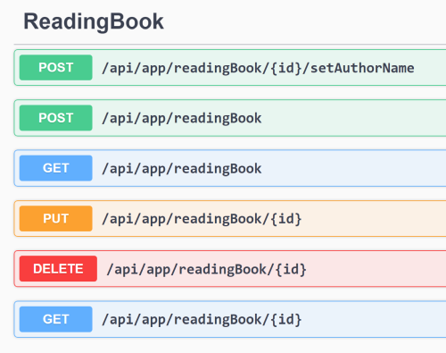
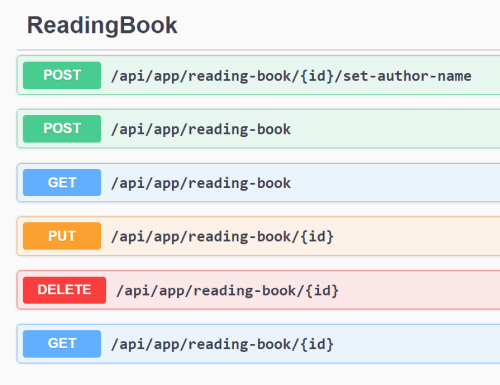

# ABP Framework 3.3 to 4.0 Migration Guide

This document introduces the breaking changes done in the ABP Framework 4.0 and explains how to fix your 3.x based solutions while upgrading to the ABP Framework 4.0.

> See this blog post (TODO: LINK) to learn what's new with the ABP Framework 4.0. This document only focuses on the breaking changes.

## Overall

Here, the overall list of the changes;

* Upgraded to the .NET 5.0.
* Upgraded to the Identity Server 4.1.1.
* Moved from Newtonsoft.Json to System.Text.Json as the JSON serializer by default.
* Made some API revisions & startup template changes for the Blazor UI.
* Switched to `kebab-case` for conventional URLs for the auto API controller routes.
* Removed the Angular Account Module Public UI (login, register... pages) since they are not being used in the default (authorization code) flow.
* Moved retry logic for the Dynamic HTTP Client Proxies to the startup template.
* Make read only for Creation audit properties of the entities.
* TODO: Deprecate the SessionState in the @abp/ng.core package
* TODO: Use IBrandingProvider in the Volo.Abp.UI package and remove the one in the Volo.Abp.AspNetCore.Mvc.UI.Theme.Shared
* TODO: Change type of the IHasExtraProperties.ExtraProperties

## Auto API Controller Route Changes

The route calculation for the [Auto API Controllers](https://docs.abp.io/en/abp/latest/API/Auto-API-Controllers) is changing with the ABP Framework version 4.0 ([#5325](https://github.com/abpframework/abp/issues/5325)). Before v4.0 the route paths were **camelCase**. After version 4.0, it's changed to **kebab-case** route paths where it is possible.

**A typical auto API before v4.0**



**camelCase route parts become kebab-case with 4.0**



### How to Fix?

You may not take any action for the MVC & Blazor UI projects.

For the Angular UI, this change may effect your client UI. If you have used the [ABP CLI Service Proxy Generation](../UI/Angular/Service-Proxies.md), you can run the server side and re-generate the service proxies. If you haven't used this tool, you should manually update the related URLs in your application.

If there are other type of clients (e.g. 3rd-party companies) using your APIs, they also need to update the URLs.

### Use the v3.x style URLs

If it is hard to change it in your application, you can still to use the version 3.x route strategy, by following one of the approaches;

- Set `UseV3UrlStyle` to `true` in the options of the `options.ConventionalControllers.Create(...)` method. Example:

```csharp
options.ConventionalControllers
    .Create(typeof(BookStoreApplicationModule).Assembly, opts =>
        {
            opts.UseV3UrlStyle = true;
        });
```

This approach affects only the controllers for the `BookStoreApplicationModule`.

- Set `UseV3UrlStyle` to `true` for the `AbpConventionalControllerOptions` to set it globally. Example:

```csharp
Configure<AbpConventionalControllerOptions>(options =>
{
    options.UseV3UrlStyle = true;
});
```

Setting it globally affects all the modules in a modular application.

## Identity Server Changes

ABP Framework upgrades the [IdentityServer4](https://www.nuget.org/packages/IdentityServer4) library from 3.x to 4.x with the ABP Framework version 4.0. IdentityServer 4.x has a lot of changes. Some of them are **breaking changes in the data structure**.

### Entity Changes

Entity changes don't directly affect your application; however, it is good to know.

#### ApiScope

As the **most critical breaking change**; Identity Server 4.x defines the `ApiScope` as an independent aggregate root. Previously, it was the child entity of the `ApiResource`. This change requires manual operation. See the _Database Changes_ section.

Also, added `Enabled(string)` and `Description(bool,true)` properties.

#### ApiResource

- Added `AllowedAccessTokenSigningAlgorithms (string)` and `ShowInDiscoveryDocument(bool, default: true)` properties

#### Client

- Added `RequireRequestObject <bool>` and `AllowedIdentityTokenSigningAlgorithms <string>` properties.
- Changed the default value of `RequireConsent` from `true` to `false`.
- Changed the default value of `RequirePkce` from `false` to `true`.

#### DeviceFlowCodes

- Added `SessionId <string>` and `Description <string>` properties.

#### PersistedGrant

- Added `SessionId <string>`, `Description <string>` and `ConsumedTime <DateTime?>` properties

### Database Changes

> Attention: **Please backup your database** before the migration!

**If you are upgrading from 3.x, then there are some steps should be done in your database.**

#### Database Schema Migration

If you are using **Entity Framework Core**, you need to add a new database migration, using the `Add-Migration` command, and apply changes to the database. Please **review the migration** script and read the sections below to understand if it affects your existing data. Otherwise, you may **lose some of your configuration**, which may not be easy to remember and re-configure.

#### Seed Code

If you haven't customized the `IdentityServerDataSeedContributor` and haven't customized the initial data inside the `IdentityServer*` tables;

1. Update `IdentityServerDataSeedContributor` class by comparing to [the latest code](https://github.com/abpframework/abp/blob/dev/templates/app/aspnet-core/src/MyCompanyName.MyProjectName.Domain/IdentityServer/IdentityServerDataSeedContributor.cs). You probably only need to add the `CreateApiScopesAsync` method and the code related to it.
2. Then you can simply clear all the **data** in these tables then execute the `DbMigrator` application to fill it with the new configuration.

#### Migrating the Configuration Data

If you've customized your IdentityServer configuration in the database or in the seed data, you should understand the changes and upgrade your code/data accordingly. Especially, the following changes will affect your application:

- `IdentityServerApiScopes` table's `Enabled` field is dropped and re-created. So, you need to enable the API scopes again manually.
- `IdentityServerApiResourceScopes` table is dropped and recreated. So, you need to backup and move your current data to the new table.
- `IdentityServerIdentityResourceClaims` table is dropped and recreated. So, you need to backup and move your current data to the new table.

You may need to perform additional steps based on how much you made custom configurations.

### Other IdentityServer Changes

IdentityServer has removed the [public origin option](https://github.com/IdentityServer/IdentityServer4/pull/4335). It was resolving HTTP/HTTPS conversion issues, but they decided to leave this to the developer. This is especially needed if you use a reverse proxy where your external protocol is HTTPS but internal protocol is HTTP.

One simple solution is to add such a middleware at the begingning of your ASP.NET Core pipeline.

```csharp
app.Use((httpContext, next) =>
{
    httpContext.Request.Scheme = "https";
    return next();
});
```

> This sample is obtained from the [ASP.NET Core documentation](https://docs.microsoft.com/en-us/aspnet/core/host-and-deploy/proxy-load-balancer#scenarios-and-use-cases). You can use it if you always use HTTPS in all environments.

### Related Resources

- https://leastprivilege.com/2020/06/19/announcing-identityserver4-v4-0/
- https://github.com/IdentityServer/IdentityServer4/issues/4592

## Blazor UI

### AbpCrudPageBase Changes

- `OpenEditModalAsync` method requires `EntityDto` instead of id (`Guid`) parameter.
- `DeleteEntityAsync` method doesn't display confirmation dialog anymore. You can use the new `EntityActions` component in DataGrids to show confirmation messages. You can also inject `IUiMessageService` to your page or component and call `ConfirmAsync` explicitly.
- TODO: Inconsistent Async suffix usage
- TODO: Refactor namespaces for Blazor components
- TODO: Update CreateGetListInputAsync on AbpCrudPageBase
- TODO: Change app to div for app container in blazor UI
