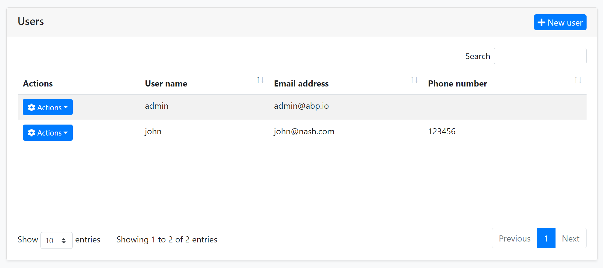

# ASP.NET Core MVC / Razor Pages: Data Tables

A Data Table (aka Data Grid) is a UI component to show tabular data to the users. There are a lot of Data table components/libraries and **you can use any one you like** with the ABP Framework. However, the startup templates come with the [DataTables.Net](https://datatables.net/) library as **pre-installed and configured**. ABP Framework provides adapters for this library and make it easy to use with the API endpoints.

An example screenshot from the user management page that shows the user list in a data table:



## DataTables.Net Integration

First of all, you can follow the official documentation to understand how the [DataTables.Net](https://datatables.net/) works. This section will focus on the ABP addons & integration points rather than fully covering the usage of this library.

### A Quick Example

You can follow the [web application development tutorial](https://docs.abp.io/en/abp/latest/Tutorials/Part-1?UI=MVC) for a complete example application that uses the DataTables.Net as the Data Table. This section shows a minimalist example.

You do nothing to add DataTables.Net library to the page since it is already added to the global [bundle](Bundling-Minification.md) by default.

First, add an `abp-table` as shown below, with an `id`:

````html
<abp-table striped-rows="true" id="BooksTable"></abp-table>
````

> `abp-table` is a [Tag Helper](Tag-Helpers/Index.md) defined by the ABP Framework, but a simple `<table...>` tag would also work.

Then call the `DataTable` plugin on the table selector:

````js
var dataTable = $('#BooksTable').DataTable(
    abp.libs.datatables.normalizeConfiguration({
        serverSide: true,
        paging: true,
        order: [[1, "asc"]],
        searching: false,
        ajax: abp.libs.datatables.createAjax(acme.bookStore.books.book.getList),
        columnDefs: [
            {
                title: l('Actions'),
                rowAction: {
                    items:
                        [
                            {
                                text: l('Edit'),
                                action: function (data) {
                                    ///...
                                }
                            }
                        ]
                }
            },
            {
                title: l('Name'),
                data: "name"
            },
            {
                title: l('PublishDate'),
                data: "publishDate",
                render: function (data) {
                    return luxon
                        .DateTime
                        .fromISO(data, {
                            locale: abp.localization.currentCulture.name
                        }).toLocaleString();
                }
            },
            {
                title: l('Price'),
                data: "price"
            }
        ]
    })
);
````

The example code above uses some ABP integration features those will be explained in the next sections.

### Configuration Normalization

`abp.libs.datatables.normalizeConfiguration` function takes a DataTables configuration and normalizes to simplify it;

* Sets `scrollX` option to `true`, if not set.
* Sets `target` index for the column definitions.
* Sets the `language` option to [localize](../../Localization.md) the table in the current language.

#### Default Configuration

`normalizeConfiguration` uses the default configuration. You can change the default configuration using the `abp.libs.datatables.defaultConfigurations` object. Example:

````js
abp.libs.datatables.defaultConfigurations.scrollX = false;
````

Here, the all configuration options;

* `scrollX`: `false` by default.
* `dom`: Default value is `<"dataTable_filters"f>rt<"row dataTable_footer"<"col-auto"l><"col-auto"i><"col"p>>`.
* `language`: A function that returns the localization text using the current language.

## Other Data Grids

You can use any library you like. For example, [see this article](https://community.abp.io/articles/using-devextreme-components-with-the-abp-framework-zb8z7yqv) to learn how to use DevExtreme Data Grid in your applications.