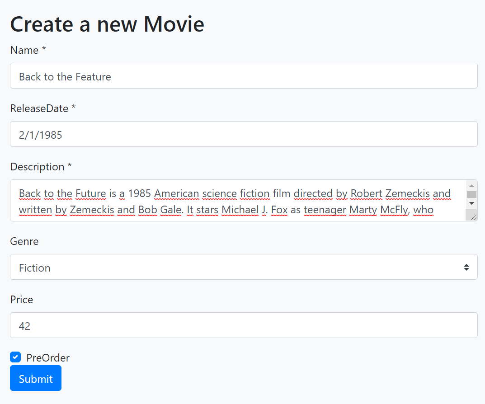

# ASP.NET Core MVC / Razor Pages: Forms & Validation

ABP Framework provides infrastructure and conventions to make easier to create forms, localize display names for the form elements and handle server & client side validation;

* [abp-dynamic-form](Tag-Helpers/Dynamic-Forms.md) tag helper automates **creating a complete form** from a C# model class: Creates the input elements, handles localization and client side validation.
* [ABP Form tag helpers](Tag-Helpers/Form-elements.md) (`abp-input`, `abp-select`, `abp-radio`...) render **a single form element** with handling localization and client side validation.
* ABP Framework automatically **localizes the display name** of a form element without needing to add a `[DisplayName]` attribute.
* **Validation errors** are automatically localized based on the user culture.

> This document is for the **client side validation** and it doesn't cover the server side validation. Check the [validation document](../../Validation.md) for server side validation infrastructure.

## The Classic Way

In a typical Bootstrap based ASP.NET Core MVC / Razor Pages UI, you [need to write](https://docs.microsoft.com/en-us/aspnet/core/mvc/models/validation#client-side-validation) such a boilerplate code to create a simple form element:

````html
<div class="form-group">
    <label asp-for="Movie.ReleaseDate" class="control-label"></label>
    <input asp-for="Movie.ReleaseDate" class="form-control" />
    <span asp-validation-for="Movie.ReleaseDate" class="text-danger"></span>
</div>
````

You can continue to use this approach if you need or prefer it. However, ABP Form tag helpers can produce the same output with a minimal code.

## ABP Dynamic Forms

[abp-dynamic-form](Tag-Helpers/Dynamic-Forms.md) tag helper completely automates the form creation. Take this model class as an example:

```csharp
using System;
using System.ComponentModel.DataAnnotations;
using Volo.Abp.AspNetCore.Mvc.UI.Bootstrap.TagHelpers.Form;

namespace MyProject.Web.Pages
{
    public class MovieViewModel
    {
        [Required]
        [StringLength(256)]
        public string Name { get; set; }

        [Required]
        [DataType(DataType.Date)]
        public DateTime ReleaseDate { get; set; }

        [Required]
        [TextArea]
        [StringLength(1000)]
        public string Description { get; set; }

        public Genre Genre { get; set; }

        public float? Price { get; set; }

        public bool PreOrder { get; set; }
    }
}
```

It uses the data annotation attributes to define validation rules and UI styles for the properties. `Genre`, is an `enum` in this example:

````csharp
namespace MyProject.Web.Pages
{
    public enum Genre
    {
        Classic,
        Action,
        Fiction,
        Fantasy,
        Animation
    }
}
````

In order to create the form in a razor page, create a property in your `PageModel` class:

```csharp
using System.Threading.Tasks;
using Microsoft.AspNetCore.Mvc;
using Microsoft.AspNetCore.Mvc.RazorPages;

namespace MyProject.Web.Pages
{
    public class CreateMovieModel : PageModel
    {
        [BindProperty]
        public MovieViewModel Movie { get; set; }

        public void OnGet()
        {
            Movie = new MovieViewModel();
        }

        public async Task OnPostAsync()
        {
            if (ModelState.IsValid)
            {
                //TODO: Save the Movie
            }
        }
    }
}
```

Then you can render the form in the `.cshtml` file:

```html
@page
@model MyProject.Web.Pages.CreateMovieModel

<h2>Create a new Movie</h2>

<abp-dynamic-form abp-model="Movie" submit-button="true" />
```

The result is shown below:



See the *Localization & Validation* section below to localize the field display names and see how the validation works.

> See [its own document](Tag-Helpers/Dynamic-Forms.md) for all options of the `abp-dynamic-form` tag helper.

## ABP Form Tag Helpers

## Localization & Validation

## See Also

* [Server Side Validation](../../Validation.md)