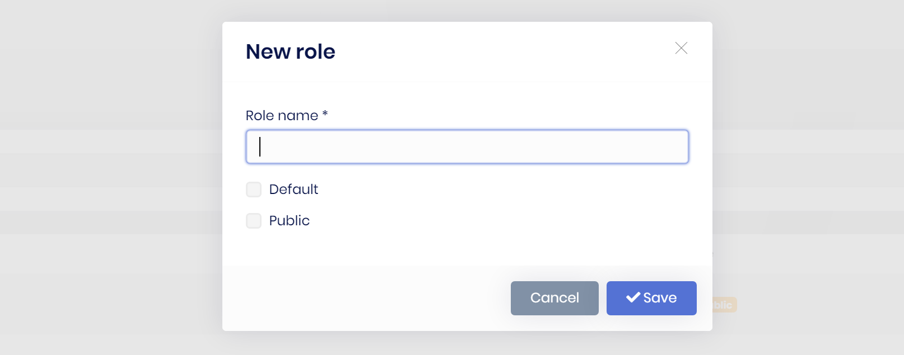
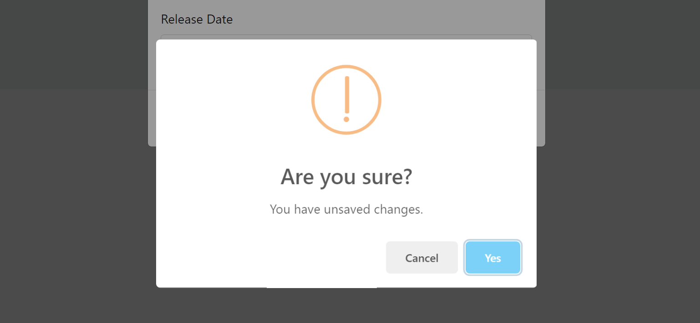
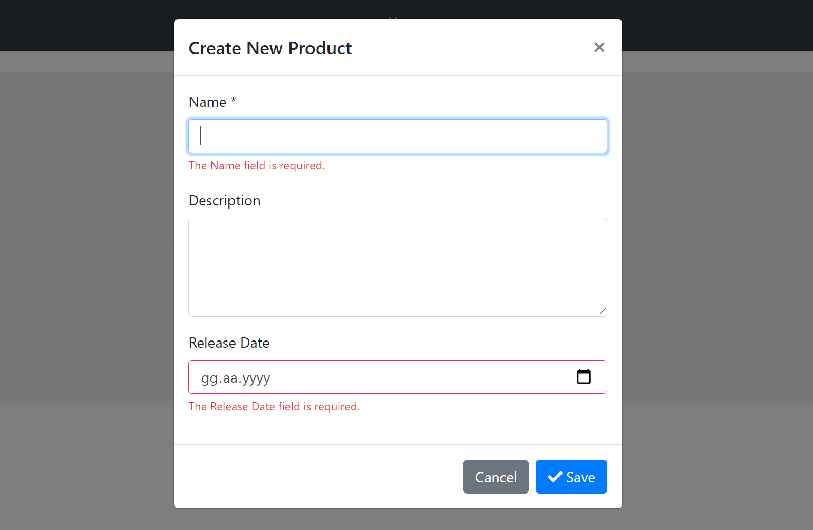

# ASP.NET Core MVC / Razor Pages UI: Modals

While you can continue to use the standard [Bootstrap way](https://getbootstrap.com/docs/4.5/components/modal/) to create, open and manage modals in your applications, ABP Framework provides a **flexible** way to manage modals by **automating common tasks** for you.

**Example: A modal dialog to create a new role entity**



ABP Framework provides the following benefits for such a modal with a form inside it;

* **Lazy loads** the modal HTML into the page and **removes** it from the DOM once its closed. This makes easy to consume a reusable modal dialog. Also, every time you open the modal, it will be a fresh new modal, so you don't have to deal with resetting the modal content.
* **Auto-focuses** the first input of the form once the modal has been opened.
* Automatically determines the **form** inside a modal and posts the form via **AJAX** instead of normal page post.
* Automatically checks if the form inside the modal **has changed, but not saved**. It warns the user in this case.
* Automatically **disables the modal buttons** (save & cancel) until the AJAX operation completes.
* Makes it easy to register a **JavaScript object that is initialized** once the modal has loaded.

So, it makes you write less code when you deal with the modals, especially the modals with a form inside.

## Basic Usage

### Creating a Modal as a Razor Page

To demonstrate the usage, we are creating a simple Razor Page, named `ProductInfoModal.cshtml`, under the `/Pages/Products` folder:


**ProductInfoModal.cshtml Content:**

````html
@page
@model MyProject.Web.Pages.Products.ProductInfoModalModel
@{
    Layout = null;
}
<abp-modal>
    <abp-modal-header title="Product Information"></abp-modal-header>
    <abp-modal-body>
        <h3>@Model.ProductName</h3>
        <div>
            
        </div>
        <p>
            @Model.ProductDescription
        </p>
        <p>
            <small><i>Reference: https://acme.com/catalog/</i></small>
        </p>
    </abp-modal-body>
    <abp-modal-footer buttons="Close"></abp-modal-footer>
</abp-modal>
````

* This page sets the `Layout` to `null` since we will show this as a modal. So, no need to wrap with a layout.
* It uses [abp-modal tag helper](../Tag-Helpers/Modals.md) to simplify creating the modal HTML code. You can use the standard  Bootstrap modal code if you prefer it.

**ProductInfoModalModel.cshtml.cs Content:**

```csharp
using Volo.Abp.AspNetCore.Mvc.UI.RazorPages;

namespace MyProject.Web.Pages.Products
{
    public class ProductInfoModalModel : AbpPageModel
    {
        public string ProductName { get; set; }

        public string ProductDescription { get; set; }

        public string ProductImageUrl { get; set; }

        public void OnGet()
        {
            ProductName = "Acme Indestructo Steel Ball";
            ProductDescription = "The ACME Indestructo Steel Ball is completely indestructible, there is nothing that can destroy it!";
            ProductImageUrl = "https://acme.com/catalog/acmeindestructo.jpg";
        }
    }
}
```

You can surely get the product info from a database or API. We are setting the properties hard-coded for the sake of simplicity,

### Defining the Modal Manager

Once you have a modal, you can open it in any page using some simple **JavaScript** code.

First, create an `abp.ModalManager` object by setting the `viewUrl`, in the JavaScript file of the page that will use the modal:

````js
var productInfoModal = new abp.ModalManager({
    viewUrl: '/Products/ProductInfoModal'
});
````

> If you only need to specify the `viewUrl`, you can directly pass it to the `ModalManager` constructor, as a shortcut. Example: `new abp.ModalManager('/Products/ProductInfoModal');`

### Opening the Modal

Then open the modal whenever you need:

````js
productInfoModal.open();
````

You typically want to open the modal when something happens; For example, when the user clicks a button:

````js
$('#OpenProductInfoModal').click(function(){
    productInfoModal.open();
});
````

The resulting modal will be like that:


#### Opening the Modal with Arguments

When you call the `open()` method, `ModalManager` loads the modal HTML by requesting it from the `viewUrl`. You can pass some **query string parameters** to this URL when you open the modal.

**Example: Pass the product id while opening the modal**

````js
productInfoModal.open({
    productId: 42
});
````

You can add a `productId` parameter to the get method:

````csharp
using Volo.Abp.AspNetCore.Mvc.UI.RazorPages;

namespace MyProject.Web.Pages.Products
{
    public class ProductInfoModalModel : AbpPageModel
    {
        //...

        public async Task OnGetAsync(int productId) //Add productId parameter
        {
            //TODO: Get the product with database with the given productId
            //...
        }
    }
}
````

In this way, you can use the `productId` to query the product from a data source.

## Modals with Forms

`abp.ModalManager` handles various common tasks (described in the introduction) when you want to use a form inside the modal.

### Example Modal with a Form

This section shows an example form to create a new product.

#### Creating the Razor Page

For this example, creating a new Razor Page, named `ProductCreateModal.cshtml`, under the `/Pages/Products` folder:


**ProductCreateModal.cshtml Content:**

````html
@page
@using Volo.Abp.AspNetCore.Mvc.UI.Bootstrap.TagHelpers.Modal
@model MyProject.Web.Pages.Products.ProductCreateModalModel
@{
    Layout = null;
}
<form method="post" action="@Url.Page("/Products/ProductCreateModal")">
    <abp-modal>
        <abp-modal-header title="Create New Product"></abp-modal-header>
        <abp-modal-body>
            <abp-input asp-for="Product.Name"/>
            <abp-input asp-for="Product.Description"/>
            <abp-input asp-for="Product.ReleaseDate"/>
        </abp-modal-body>
        <abp-modal-footer buttons="@AbpModalButtons.Save | @AbpModalButtons.Cancel"></abp-modal-footer>
    </abp-modal>
</form>
````

* The `abp-modal` has been wrapped by the `form`. This is needed to place the `Save` and the `Cancel` buttons into the form. In this way, the `Save` button acts as the `submit` button for the `form`.
* Used the [abp-input tag helpers](../Tag-Helpers/Form-Elements.md) to simplify to create the form elements. Otherwise, you need to write more HTML.

**ProductCreateModal.cshtml.cs Content:**

```csharp
using System.Threading.Tasks;
using Microsoft.AspNetCore.Mvc;
using Volo.Abp.AspNetCore.Mvc.UI.RazorPages;

namespace MyProject.Web.Pages.Products
{
    public class ProductCreateModalModel : AbpPageModel
    {
        [BindProperty]
        public PoductCreationDto Product { get; set; }

        public async Task OnGetAsync()
        {
            //TODO: Get logic, if available
        }

        public async Task<IActionResult> OnPostAsync()
        {
            //TODO: Save the Product...

            return NoContent();
        }
    }
}
```

* This is a simple `PageModal` class. The `[BindProperty]` make the form binding to the model when you post (submit) the form; The standard ASP.NET Core system.
* `OnPostAsync` returns `NoContent` (this method is defined by the base `AbpPageModel` class). Because we don't need to a return value in the client side, after the form post operation.

**PoductCreationDto:**

`ProductCreateModalModel` uses a `PoductCreationDto` class defined as shown below:

````csharp
using System;
using System.ComponentModel.DataAnnotations;
using Volo.Abp.AspNetCore.Mvc.UI.Bootstrap.TagHelpers.Form;

namespace MyProject.Web.Pages.Products
{
    public class PoductCreationDto
    {
        [Required]
        [StringLength(128)]
        public string Name { get; set; }
        
        [TextArea(Rows = 4)]
        [StringLength(2000)]
        public string Description { get; set; }
        
        [DataType(DataType.Date)]
        public DateTime ReleaseDate { get; set; }
    }
}
````

* `abp-input` Tag Helper can understand the data annotation attributes and uses them to shape and validate the form elements. See the [abp-input tag helpers](../Tag-Helpers/Form-Elements.md) document to learn more.

#### Defining the Modal Manager

Again, create an `abp.ModalManager` object by setting the `viewUrl`, in the JavaScript file of the page that will use the modal:

````js
var productCreateModal = new abp.ModalManager({
    viewUrl: '/Products/ProductCreateModal'
});
````

#### Opening the Modal

Then open the modal whenever you need:

````js
productCreateModal.open();
````

You typically want to open the modal when something happens; For example, when the user clicks a button:

````js
$('#OpenProductCreateModal').click(function(){
    productCreateModal.open();
});
````

So, the complete code will be something like that (assuming you have a `button` with `id` is `OpenProductCreateModal` on the view side):

```js
$(function () {

    var productCreateModal = new abp.ModalManager({
        viewUrl: '/Products/ProductCreateModal'
    });

    $('#OpenProductCreateModal').click(function () {
        productCreateModal.open();
    });

});
```

The resulting modal will be like that:


#### Saving the Modal

When you click to the `Save` button, the form is posted to the server. If the server returns a **success response**, then the `onResult` event is triggered with some arguments including the server response and the modal is automatically closed.

An example callback that logs the arguments passed to the `onResult` method:

````js
productCreateModal.onResult(function(){
   console.log(arguments);
});
````

If the server returns a failed response, it shows the error message returned from the server and keeps the modal open.

> See the *Modal Manager Reference* section below for other modal events.

#### Canceling the Modal

If you click to the Cancel button with some changes made but not saved, you get such a warning message:



If you don't want such a check & message, you can add `data-check-form-on-close="false"` attribute to your `form` element. Example:

````html
<form method="post"
      action="@Url.Page("/Products/ProductCreateModal")"
      data-check-form-on-close="false">
````

### Form Validation

`ModalManager` automatically triggers the form validation when you click to the `Save` button or hit the `Enter` key on the form:



See the [Forms & Validation document](../Forms-Validation.md) to learn more about the validation.

## Modals with Script Files

You may need to perform some logic for your modal. To do that, create a JavaScript file like below:

````js
abp.modals.ProductInfo = function () {

    function initModal(modalManager, args) {
        var $modal = modalManager.getModal();
        var $form = modalManager.getForm();

        $modal.find('h3').css('color', 'red');
        
        console.log('initialized the modal...');
    };

    return {
        initModal: initModal
    };
};
````

* This code simply adds a `ProductInfo` class into the `abp.modals` namespace. The `ProductInfo` class exposes a single public function: `initModal`.
* `initModal` method is called by the `ModalManager` once the modal HTML is inserted to DOM and ready for the initialization logic.
* `modalManager` parameter is the `ModalManager` object related to this modal instance. So, you can use any function on it in your code. See the *ModalManager Reference* section.

Then include this file to the page that you use the modal:

````html
<abp-script src="/Pages/Products/ProductInfoModal.js"/>
<abp-script src="/Pages/Products/Index.js"/>
````

* We've use the `abp-script` Tag Helper here. See the [Bundling & Minification](Bundling-Minification.md) document if you want to understand it. You can use the standard `script` tag. It doesn't matter for this case.

Finally, set the `modalClass` option while creating the `ModalManager` instance:

````js
var productInfoModal = new abp.ModalManager({
    viewUrl: '/Products/ProductInfoModal',
    modalClass: 'ProductInfo' //Matches to the abp.modals.ProductInfo
});
````

### Lazy Loading the Script File

Instead of adding the `ProductInfoModal.js` to the page you use the modal, you can configure it to lazy load the script file when the first time the modal is opened.

Example:

````js
var productInfoModal = new abp.ModalManager({
    viewUrl: '/Products/ProductInfoModal',
    scriptUrl: '/Pages/Products/ProductInfoModal.js', //Lazy Load URL
    modalClass: 'ProductInfo'
});
````

* `scriptUrl` is used to set the URL to load the script file of the modal.
* In this case, you no longer need to include the `ProductInfoModal.js` to the page. It will be loaded on demand.

#### Tip: Bundling & Minification

While lazy loading seems cool at the beginning, it requires an additional call to the server when you first open the modal.

Instead, you can use the [Bundling & Minification](Bundling-Minification.md) system to create a bundle (that is a single and minified file on production) for all the used script files for a page:

````html
<abp-script-bundle>
    <abp-script src="/Pages/Products/ProductInfoModal.js"/>
    <abp-script src="/Pages/Products/Index.js"/>
</abp-script-bundle>
````

This is efficient if the script file is not large and frequently opened while users use the page.

Alternatively, you can define the `abp.modals.ProductInfo` class in the page's main JavaScript file if the modal is only and always used in the same page. In this case, you don't need to another external script file at all.

## ModalManager Reference

### Options

Options can be passed when you create a new `ModalManager` object:

````js
var productInfoModal = new abp.ModalManager({
    viewUrl: '/Products/ProductInfoModal',
    //...other options
});
````

Here, the list of all available options;

* `viewUrl` (required, `string`): The URL to lazy load the HTML of the modal.
* `scriptUrl` (optional, `string`): A URL to lazy load a JavaScript file. It is loaded only once, when the modal first opened.
* `modalClass` (optional, `string`): A JavaScript class defined in the `abp.modals` namespace that can be used to execute code related to the modal.

### Functions

When you create a new `ModalManager` object, you can use its functions to perform operations on the modal. Example:

````js
var myModal = new abp.ModalManager({
    //...options
});

//Open the modal
myModal.open();

//Close the modal
myModal.close();
````

Here, the list of all available functions of the `ModalManager` object;

* `open([args])`: Opens the modal dialog. It can get an `args` object that is converted to query string while getting the `viewUrl` from the server. For example, if `args` is `{ productId: 42 }`, then the `ModalManager` passes `?productId=42` to the end of the `viewUrl` while loading the view from the server.
* `reopen()`: Opens the modal with the latest provided `args` for the `open()` method. So, it is a shortcut if you want to re-open the modal with the same `args`.
* `close()`: Closes the modal. The modal HTML is automatically removed from DOM once it has been closed.
* `getModalId()`: Gets the `id` attribute of the container that contains the view returned from the server. This is a unique id per modal and it doesn't change after you create the `ModalManager`.
* `getModal()`: Returns the modal wrapper DOM element (the HTML element with the `modal` CSS class) as a JQuery selection, so you can perform any JQuery method on it.
* `getForm()`: Returns the `form` HTML element  as a JQuery selection, so you can perform any JQuery method on it. It returns `null` if the modal has no form inside it.
* `getArgs()` Gets the latest arguments object provided while opening the modal.
* `getOptions()`: Gets the options object passed to the `ModalManager` constructor.
* `setResult(...)`: Triggers the `onResult` event with the provided arguments. You can pass zero or more arguments those are directly passed to the `onResult` event. This function is generally called by the modal script to notify the page that uses the modal.

### Events

When you create a new `ModalManager` object, you can use its functions register to events of the modal. Examples:

````js
var myModal = new abp.ModalManager({
    //...options
});

myModal.onOpen(function () {
    console.log('opened the modal...');
});

myModal.onClose(function () {
    console.log('closed the modal...');
});
````

Here, the list of all available functions to register to events of the `ModalManager` object;

* `onOpen(callback)`: Registers a callback function to get notified once the modal is opened. It is triggered when the modal is completely visible on the UI.
* `onClose(callback)`: Registers a callback function to get notified once the modal is closed. It is triggered when the modal is completely invisible on the UI.
* `onResult(callback)`: Registers a callback function that is triggered when the ``setResult(...)` method is called. All the parameters sent to the `setResult` method is passed to the callback.