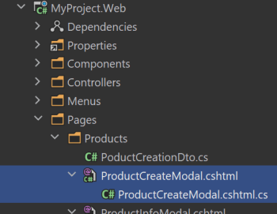
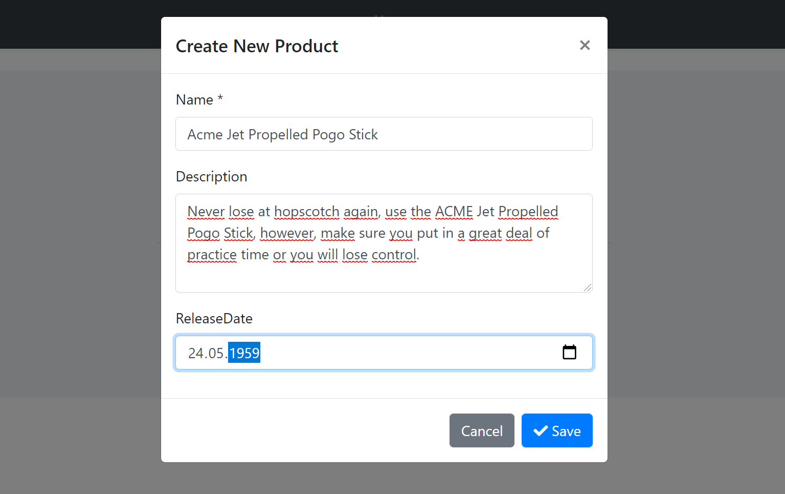

# ASP.NET Core MVC / Razor Pages UI: Modals

While you can continue to use the standard [Bootstrap way](https://getbootstrap.com/docs/4.5/components/modal/) to create, open and manage modals in your applications, ABP Framework provides a **flexible** way to manage modals by **automating common tasks** for you.

**Example: A modal dialog to create a new role entity**


ABP Framework provides the following benefits for such a modal with a form inside it;

* **Lazy loads** the modal HTML into the page and **removes** it from the DOM once its closed. This makes easy to consume a reusable modal dialog. Also, every time you open the modal, it will be a fresh new modal, so you don't have to deal with resetting the modal content.
* **Auto-focuses** the first input of the form once the modal has been opened.
* Automatically determines the **form** inside a modal and posts the form via **AJAX** instead of normal page post.
* Automatically checks if the form inside the modal **has changed, but not saved**. It warns the user in this case.
* Automatically **disables the modal buttons** (save & cancel) until the AJAX operation completes.
* Makes it easy to register a **JavaScript object that is initialized** once the modal has loaded.

So, it makes you write less code when you deal with the modals, especially the modals with a form inside.

## Basic Usage

### Creating a Modal as a Razor Page

To demonstrate the usage, we are creating a simple Razor Page, named `ProductInfoModal.cshtml`, under the `/Pages/Products` folder:


**ProductInfoModal.cshtml Content:**

````html
@page
@model MyProject.Web.Pages.Products.ProductInfoModalModel
@{
    Layout = null;
}
<abp-modal>
    <abp-modal-header title="Product Information"></abp-modal-header>
    <abp-modal-body>
        <h3>@Model.ProductName</h3>
        <div>
            
        </div>
        <p>
            @Model.ProductDescription
        </p>
        <p>
            <small><i>Reference: https://acme.com/catalog/</i></small>
        </p>
    </abp-modal-body>
    <abp-modal-footer buttons="Close"></abp-modal-footer>
</abp-modal>
````

* This page sets the `Layout` to `null` since we will show this as a modal. So, no need to wrap with a layout.
* It uses [abp-modal tag helper](../Tag-Helpers/Modals.md) to simplify creating the modal HTML code. You can use the standard  Bootstrap modal code if you prefer it.

**ProductInfoModalModel.cshtml.cs Content:**

```csharp
using Volo.Abp.AspNetCore.Mvc.UI.RazorPages;

namespace MyProject.Web.Pages.Products
{
    public class ProductInfoModalModel : AbpPageModel
    {
        public string ProductName { get; set; }

        public string ProductDescription { get; set; }

        public string ProductImageUrl { get; set; }

        public void OnGet()
        {
            ProductName = "Acme Indestructo Steel Ball";
            ProductDescription = "The ACME Indestructo Steel Ball is completely indestructible, there is nothing that can destroy it!";
            ProductImageUrl = "https://acme.com/catalog/acmeindestructo.jpg";
        }
    }
}
```

You can surely get the product info from a database or API. We are setting the properties hard-coded for the sake of simplicity,

### Defining the Modal Manager

Once you have a modal, you can open it in any page using some simple **JavaScript** code.

First, create an `abp.ModalManager` object by setting the `viewUrl`, in the JavaScript file of the page that will use the modal:

````js
var productInfoModal = new abp.ModalManager({
    viewUrl: '/Products/ProductInfoModal'
});
````

> If you only need to specify the `viewUrl`, you can directly pass it to the `ModalManager` constructor, as a shortcut. Example: `new abp.ModalManager('/Products/ProductInfoModal');`

### Opening the Modal

Then open the modal whenever you need:

````js
productInfoModal.open();
````

You typically want to open the modal when something happens; For example, when the user clicks a button:

````js
$('#OpenProductInfoModal').click(function(){
    productInfoModal.open();
});
````

The resulting modal will be like that:


## Modals with Forms

`abp.ModalManager` handles various common tasks (described in the introduction) when you want to use a form inside the modal.

### Example Modal with a Form

This section shows an example form to create a new product.

#### Creating the Razor Page

For this example, creating a new Razor Page, named `ProductCreateModal.cshtml`, under the `/Pages/Products` folder:



**ProductCreateModal.cshtml Content:**

````html
@page
@using Volo.Abp.AspNetCore.Mvc.UI.Bootstrap.TagHelpers.Modal
@model MyProject.Web.Pages.Products.ProductCreateModalModel
@{
    Layout = null;
}
<form method="post" action="@Url.Page("/Products/ProductCreateModal")">
    <abp-modal>
        <abp-modal-header title="Create New Product"></abp-modal-header>
        <abp-modal-body>
            <abp-input asp-for="Product.Name"/>
            <abp-input asp-for="Product.Description"/>
            <abp-input asp-for="Product.ReleaseDate"/>
        </abp-modal-body>
        <abp-modal-footer buttons="@AbpModalButtons.Save | @AbpModalButtons.Cancel"></abp-modal-footer>
    </abp-modal>
</form>
````

* The `abp-modal` has been wrapped by the `form`. This is needed to place the `Save` and the `Cancel` buttons into the form. In this way, the `Save` button acts as the `submit` button for the `form`.
* Used the [abp-input tag helpers](../Tag-Helpers/Form-Elements.md) to simplify to create the form elements. Otherwise, you need to write more HTML.

**ProductCreateModal.cshtml.cs Content:**

```csharp
using System.Threading.Tasks;
using Microsoft.AspNetCore.Mvc;
using Volo.Abp.AspNetCore.Mvc.UI.RazorPages;

namespace MyProject.Web.Pages.Products
{
    public class ProductCreateModalModel : AbpPageModel
    {
        [BindProperty]
        public PoductCreationDto Product { get; set; }

        public async Task OnGetAsync()
        {
            //TODO: Get logic, if available
        }

        public async Task<IActionResult> OnPostAsync()
        {
            //TODO: Save the Product...

            return NoContent();
        }
    }
}
```

* This is a simple `PageModal` class. The `[BindProperty]` make the form binding to the model when you post (submit) the form; The standard ASP.NET Core system.
* `OnPostAsync` returns `NoContent` (this method is defined by the base `AbpPageModel` class). Because we don't need to a return value in the client side, after the form post operation.

**PoductCreationDto:**

`ProductCreateModalModel` uses a `PoductCreationDto` class defined as shown below:

````csharp
using System;
using System.ComponentModel.DataAnnotations;
using Volo.Abp.AspNetCore.Mvc.UI.Bootstrap.TagHelpers.Form;

namespace MyProject.Web.Pages.Products
{
    public class PoductCreationDto
    {
        [Required]
        [StringLength(128)]
        public string Name { get; set; }
        
        [TextArea(Rows = 4)]
        [StringLength(2000)]
        public string Description { get; set; }
        
        [DataType(DataType.Date)]
        public DateTime ReleaseDate { get; set; }
    }
}
````

* `abp-input` Tag Helper can understand the data annotation attributes and uses them to shape and validate the form elements. See the [abp-input tag helpers](../Tag-Helpers/Form-Elements.md) document to learn more.

#### Defining the Modal Manager

Again, create an `abp.ModalManager` object by setting the `viewUrl`, in the JavaScript file of the page that will use the modal:

````js
var productCreateModal = new abp.ModalManager({
    viewUrl: '/Products/ProductCreateModal'
});
````

#### Opening the Modal

Then open the modal whenever you need:

````js
productCreateModal.open();
````

You typically want to open the modal when something happens; For example, when the user clicks a button:

````js
$('#OpenProductCreateModal').click(function(){
    productCreateModal.open();
});
````

So, the complete code will be something like that (assuming you have a `button` with `id` is `OpenProductCreateModal` on the view side):

```js
$(function () {

    var productCreateModal = new abp.ModalManager({
        viewUrl: '/Products/ProductCreateModal'
    });

    $('#OpenProductCreateModal').click(function () {
        productCreateModal.open();
    });

});
```

The resulting modal will be like that:



#### Saving the Modal

When you click to the `Save` button, the form is posted to the server. If server returns a success response, the modal is closed. Otherwise, it shows the error message returned from the server.

> You can register to the events to be informed when form is saved or modal is closed. See the *Modal Manager Reference* section below.

#### Canceling the Modal

If you click to the Cancel button with some changes made but not saved, you get such a warning message:


### Form Validation

`ModalManager` automatically triggers the form validation when you click to the `Save` button or hit the `Enter` key on the form:


See the [Forms & Validation document](../Forms-Validation.md) to learn more about the validation.

## ModalManager Reference

TODO

### Options

TODO

### Functions

TODO

### Events

TODO