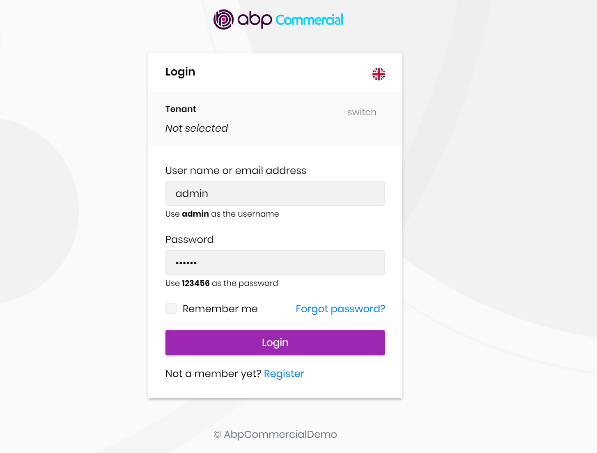

# ASP.NET Core MVC / Razor Pages: UI Theming

## Introduction

ABP Framework provides a complete **UI Theming** system with the following goals:

* Reusable [application modules](../../Modules/Index.md) are developed **theme-independent**, so they can work with any UI theme.
* UI theme is **decided by the final application**.
* The theme is distributed via NuGet/NPM packages, so it is **easily upgradable**.
* The final application can **customize** the selected theme.

In order to accomplish these goals, ABP Framework;

* Determines a set of **base libraries** used and adapted by all the themes. So, module and application developers can depend on and use these libraries without depending on a particular theme.
* Provides a system that consists of [navigation menus](Navigation-Menu.md), [toolbars](Toolbars.md), [layout hooks](Layout-Hooks.md)... that is implemented by all the themes. So, the modules and the application to contribute to the layout to compose a consistent application UI.

### Current Themes

Currently, two themes are **officially provided**:

* The [Basic Theme](Basic-Theme.md) is the minimalist theme with the plain Bootstrap style. It is **open source and free**.
* The [Lepton Theme](https://commercial.abp.io/themes) is a **commercial** theme developed by the core ABP team and is a part of the [ABP Commercial](https://commercial.abp.io/) license.

There are also some community-driven themes for the ABP Framework (you can search on the web).

## Overall

### The Base Libraries

All the themes must depend on the [@abp/aspnetcore.mvc.ui.theme.shared](https://www.npmjs.com/package/@abp/aspnetcore.mvc.ui.theme.shared) NPM package, so they are indirectly depending on the following libraries:

* [Twitter Bootstrap](https://getbootstrap.com/) as the fundamental HTML/CSS framework.
* [JQuery](https://jquery.com/) for DOM manipulation.
* [DataTables.Net](https://datatables.net/) for data grids.
* [JQuery Validation](https://jqueryvalidation.org/) for client side & [unobtrusive](https://github.com/aspnet/jquery-validation-unobtrusive) validation
* [FontAwesome](https://fontawesome.com/) as the fundamental CSS font library.
* [SweetAlert](https://sweetalert.js.org/) to show fancy alert message and confirmation dialogs.
* [Toastr](https://github.com/CodeSeven/toastr) to show toast notifications.
* [Lodesh](https://lodash.com/) as a utility library.
* [Luxon](https://moment.github.io/luxon/) for date/time operations.
* [JQuery Form](https://github.com/jquery-form/form) for AJAX forms.
* [bootstrap-datepicker](https://github.com/uxsolutions/bootstrap-datepicker) to show date pickers.
* [Select2](https://select2.org/) for better select/combo boxes.
* [Timeago](http://timeago.yarp.com/) to show automatically updating fuzzy timestamps.
* [malihu-custom-scrollbar-plugin](https://github.com/malihu/malihu-custom-scrollbar-plugin) for custom scrollbars.

These libraries are selected as the base libraries and available to the applications and modules.

#### Abstractions / Wrappers

There are some abstractions in the ABP Framework to make your code independent from some of these libraries too. Examples;

* [Tag Helpers](Tag-Helpers/Index.md) makes it easy to generate the Bootstrap UIs.
* JavaScript [Message](JavaScript-API/Message.md) and [Notification](JavaScript-API/Notify.md) APIs provides abstractions to use the Sweetalert and Toastr.
* [Forms & Validation](Forms-Validation.md) system automatically handles the validation, so you mostly don't directly type any validation code.

### The Layouts

The main responsibility of a theme is to provide the layouts. There are **three pre-defined layouts must be implemented by all the themes**:

* **Application**: The default layout which is used by the main application pages.
* **Account**: Mostly used by the [account module](../../Modules/Account.md) for login, register, forgot password... pages.
* **Empty**: The Minimal layout that has no layout components at all.

Layout names are constants defined in the `Volo.Abp.AspNetCore.Mvc.UI.Theming.StandardLayouts` class.

#### The Application Layout

This is the default layout which is used by the main application pages. The following image shows the user management page in the [Basic Theme](Basic-Theme.md) application layout:

And the same page is shown below with the [Lepton Theme](https://commercial.abp.io/themes) application layout:

As you can see, the page is the same, but the look is completely different in the themes above.

The application layout typically includes the following parts;

* A [main menu](Navigation-Menu.md)
* Main [Toolbar](Toolbars.md) with the following components;
  * User menu
  * Language switch dropdown
* [Page alerts](Page-Alerts.md)
* The page content (aka `RenderBody()`)
* [Layout hooks](Layout-Hooks.md)

Some themes may provide more parts like breadcrumbs, page header & toolbar... etc. See the *Layout Parts* section.

#### The Account Layout

The Account layout is typically used by the [account module](../../Modules/Account.md) for login, register, forgot password... pages.

This layout typically provides the following parts;

* Language switch dropdown
* Tenant switch area (if the application is [multi-tenant](../../Multi-Tenancy.md) and the current is resolved by the cookie)
* [Page alerts](Page-Alerts.md)
* The page content (aka `RenderBody()`)
* [Layout hooks](Layout-Hooks.md)

The [Basic Theme](Basic-Theme.md) renders the top navigation bar for this layout too (as shown above)

Here, the account layout of the Lepton Theme:

The [Lepton Theme](https://commercial.abp.io/themes) shows the application logo and footer in this layout.

> You can override theme layouts completely or partially in an application to [customize](Customization-User-Interface.md) it.

#### The Empty Layout

The empty layout provides an empty page, however it typically includes the following parts;

* [Page alerts](Page-Alerts.md)
* The page content (aka `RenderBody()`)
* [Layout hooks](Layout-Hooks.md)

## Implementing a Theme

TODO