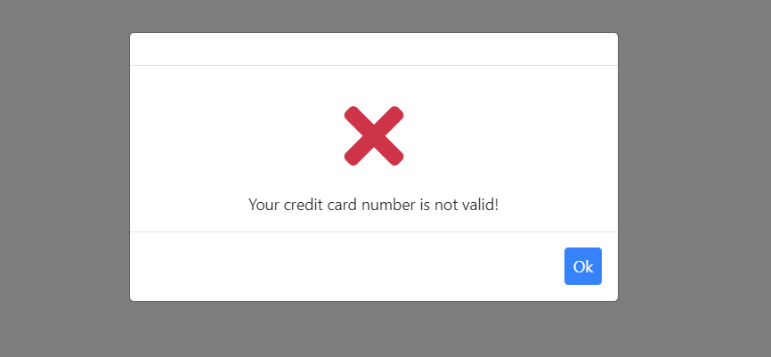

# Blazor UI: Message Service

UI message service is used to show nice-looking messages to the user as a blocking dialog.

## Quick Example

Simply [inject](../../Dependency-Injection.md) `IUiMessageService` to your page or component and call the `Success` method to show a success message.

```csharp
namespace MyProject.Blazor.Pages
{
    public partial class Index
    {
        private readonly IUiMessageService _uiMessageService;

        public Index(IUiMessageService uiMessageService)
        {
            _uiMessageService = uiMessageService;
        }

        public async Task SaveAsync()
        {
            await _uiMessageService.Success(
                "Your changes have been successfully saved!",
                "Congratulations");
        }
    }
}
```

It will show a dialog on the UI:


If you inherit your page or component from the `AbpComponentBase` class, you can use the `Message` property to access the `IUiMessageService` as a pre-injected property.

```csharp
namespace MyProject.Blazor.Pages
{
    public partial class Index : AbpComponentBase
    {
        public async Task SaveAsync()
        {
            await Message.Success(
                "Your changes have been successfully saved!",
                "Congratulations");
        }
    }
}
```
> You typically use `@inherits AbpComponentBase` in the `.razor` file to inherit from the `AbpComponentBase`, instead of inheriting in the code behind file.

## Informative Messages

There are four types of informative message functions:

* `Info(...)`
* `Success(...)`
* `Warn(...)`
* `Error(...)`

All of these methods get three parameters:

* `message`: The message (`string`) to be shown.
* `title`: An optional (`string`) title.
* `options`: An optional (`Action`) to configure UI message options.

**Example: Show an error message**

````csharp
Message.Error('Your credit card number is not valid!');
````




## Confirmation Message

`IUiMessageService.Confirm(...)` method can be used to get a confirmation from the user.

**Example**

Use the following code to get a confirmation result from the user:

```csharp
public async Task DeleteAsync()
{
    var confirmed = await _uiMessageService.Confirm("Are you sure to delete the 'admin' role?");
    if(confirmed)
    {
        //Delete the 'admin' role here.
    }
}
```

The resulting UI will be like shown below:


If the user has clicked the `Yes` button, the `Confirm` method's return value will be `true`.

## Configuration

It is easy to change default message options if you like to it per message. Provide an `action` to the `options` parameter as shown below.

```csharp
await _uiMessageService.Success(
    "Your changes have been successfully saved!",
    "Congratulations",
    (options) =>
    {
        options.MessageIcon = "msg-icon-new";
        options.CenterMessage = false;
    });
```

List of the options that you can change by providing the `action` parameter.

* `CenterMessage` : (Default: true) If true, the message dialogue will be centered on the screen.
* `ShowMessageIcon` : (Default: true) If true, the message dialogue will show the large icon for the current message type.
* `MessageIcon` : Overrides the build-in message icon.
* `OkButtonText` : Custom text for the OK button.
* `OkButtonIcon` : Custom icon for the OK button.
* `ConfirmButtonText` : Custom text for the Confirmation button.
* `ConfirmButtonIcon` : Custom icon for the Confirmation button.
* `CancelButtonText` : Custom text for the Cancel button.
* `CancelButtonIcon` : Custom icon for the Cancel button.

> "Confirm", "Cancel" and "Yes" texts are automatically localized based on the current language.